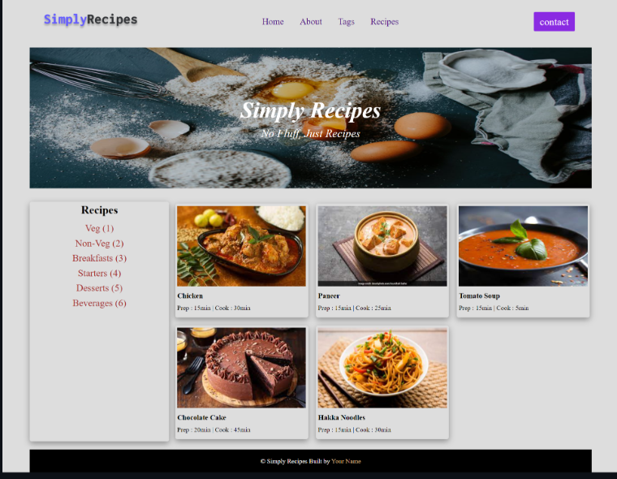
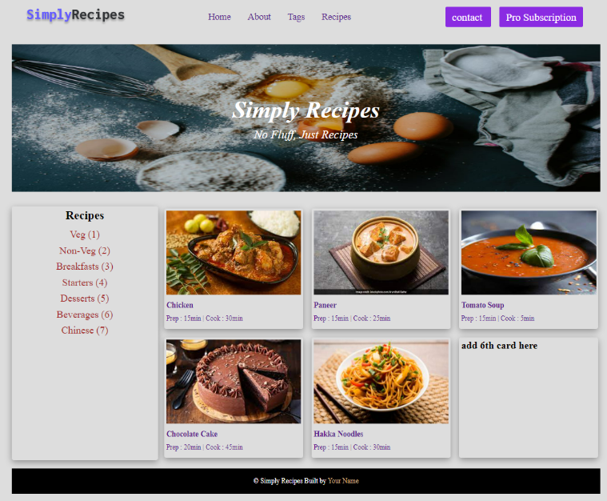
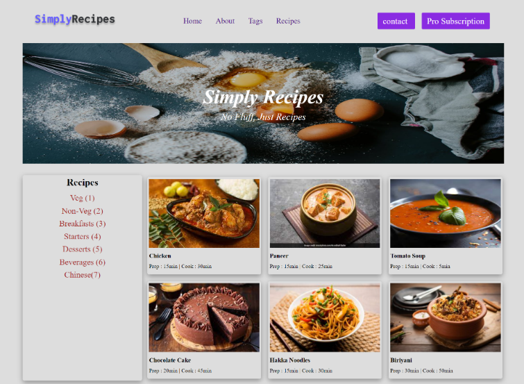

# Question 5
## Main Preview

# Task
### Add a button inside header [Pro Subscription], adding a recipes card and change copyright text

// Adding button [Pro Subscription]

let button = document.createElement("a");
let buttonTxt = document.createTextNode("Pro Subscription");
button.appendChild(buttonTxt);

let addBtn = document.querySelector(".navbar .nav-center div:last-child");
addBtn.appendChild(button);
button.classList.add("btn");
button.style.cursor = "pointer";

// Adding Recipes [Chinese(7)]

let recipesList = document.querySelector(
  ".recipes-container .tags-container div"
);

let newRecipes = document.createElement("a");
let newRecipesName = document.createTextNode("Chinese(7)");
newRecipes.appendChild(newRecipesName);

recipesList.appendChild(newRecipes);
recipesList.style.cursor = "pointer";

// Adding recipes card
// Add a div

let card = document.querySelector(".recipe-gallery");

let newCard = document.createElement("div");
card.appendChild(newCard);
newCard.classList.add("card");

// Adding image inside card
let selectCard = document.querySelector(".recipe-gallery .card:last-child");

let cardImage = document.createElement("img");
cardImage.src = "./img/recipe-6.jpeg";
cardImage.classList.add("recipe-img");
selectCard.appendChild(cardImage);

// Adding heading

let cardHeading = document.createElement("h5");
let cardHeadingTxt = document.createTextNode("Biriyani");
cardHeading.appendChild(cardHeadingTxt);
cardHeading.classList.add("recipe-name");

selectCard.appendChild(cardHeading);

// Adding Recipes text

let cardDecp = document.createElement("p");
let cardDecpTxt = document.createTextNode("Prep : 30min | Cook : 50min");
cardDecp.appendChild(cardDecpTxt);
cardDecp.classList.add("recipe-disp");

selectCard.appendChild(cardDecp);

# OUTPUT
